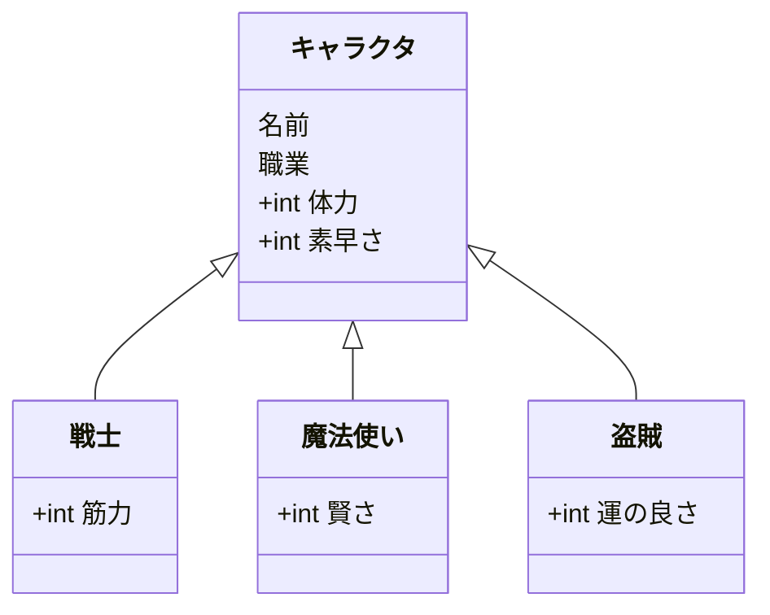

```mermaid
classDiagram
class キャラクタ
キャラクタ : 名前
キャラクタ : 職業
キャラクタ : +int 体力
キャラクタ : +int 素早さ
class 戦士
戦士 : +int 筋力
class 魔法使い
魔法使い : +int 賢さ
class 盗賊
盗賊 : +int 運の良さ

キャラクタ <|-- 戦士
キャラクタ <|-- 魔法使い   
キャラクタ <|-- 盗賊
```
