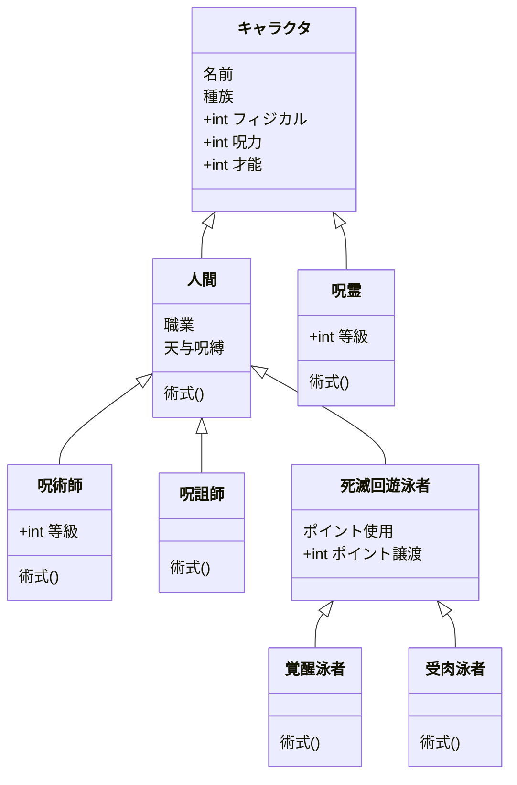

```mermaid
classDiagram
class キャラクタ
キャラクタ : 名前
キャラクタ : 種族
キャラクタ : +int フィジカル
キャラクタ : +int 呪力
キャラクタ : +int 才能

class 人間
人間 : 職業
人間 : 天与呪縛
人間 : 術式()

class 呪霊
呪霊 : +int 等級
呪霊 : 術式()

class 呪術師
呪術師 : +int 等級
呪術師 : 術式()

class 呪詛師
呪詛師 : 術式()

class 死滅回遊泳者
死滅回遊泳者 : ポイント使用
死滅回遊泳者 : +int ポイント譲渡

class 覚醒泳者
覚醒泳者 : 術式()

class 受肉泳者
受肉泳者 : 術式()

キャラクタ <|--人間
キャラクタ <|--呪霊
人間 <|--呪術師 
人間 <|--呪詛師  
人間 <|--死滅回遊泳者
死滅回遊泳者<|--覚醒泳者
死滅回遊泳者<|--受肉泳者

```
